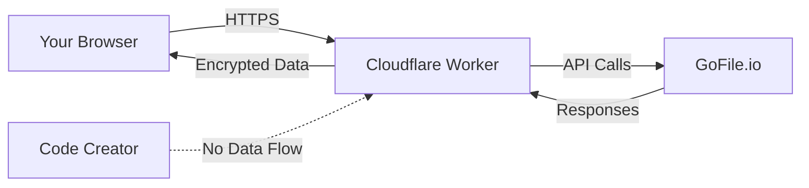

# GoFile.io File Indexer (Cloudflare Worker)

A Cloudflare Worker-based indexer for [gofile.io](https://gofile.io) that improves download speed, enhances stability, and offers unlimited access to private free account files. Automatically fetches and serves gofile links through fast, reliable, permanent links with extreme pause-resume support and multithreaded downloads.

** CLICK THE BUTTON BELOW TO GENERATE YOUR CLOUDFLARE WORKER CODE AND DEPLOY (SEE INSTRUCTIONS) **

    

**Unofficial GoFile.io File Indexer** built for Cloudflare Workers.  
⚠️ **Disclaimer**: This is **not** an official GoFile.io product. Use at your own risk.

---

## 🚨 Important Notice About Code Generator
**❗ We show ads on the code generator website** to support maintenance costs, but:  
- 🔒 **Generated code contains NO ADS/TRACKING**  
- 🌐 **Your files/token never pass through our servers**  
- 🔑 Authentication handled directly between Cloudflare Worker ↔ GoFile.io  
- 🛡️ Zero third-party access to your data (including developers)

---

## 🚀 Key Features
- **⚡ Blazing Fast Downloads** - Leverages Cloudflare's global CDN
- **⏯️ Extreme Resume/Pause Support** - Permanent links for interrupted downloads
- **🧵 Multi-Threading Ready** - Accelerated parallel file transfers
- 🌓 **Multiple UI Themes** - Lite/Dark/Simple modes (more coming)
- 🔄 **DNS Restriction Bypass** - Universal access through Cloudflare proxy
- 📂 **Real-Time Indexing** - Instant reflection of GoFile.io changes
- 🔍 **Search-Friendly** - Clean URLs for easy navigation
- 📱 **Mobile-Optimized** - Responsive on all devices

---

## New beta features: 
- **added private/shared folder indexing and download option.** - use beta theme

## ⚠️ Important Notes
- **Complete Data Isolation** - We never see your token/files
- **Personal Use Recommended** - Avoid sensitive/copyrighted content
- **Token Storage** - Only exists in your Cloudflare Worker environment
- **No Guarantees** - Subject to Cloudflare/GoFile.io availability

---

## 🛠️ Deployment Steps

### Step 1: Generate Worker Code
1. Visit [Gofile Code Generator](https://developeranaz.github.io/webapps/gofile.io/)
2. Enter your **registered GoFile.io email**
3. Click `Send login link` and check your email for authentication token/URL
4. Paste received token in `Authentication Token` field
5. Select preferred theme
6. Click `Generate Code` and copy the generated code

### Step 2: Deploy to Cloudflare Workers
1. Login to [Cloudflare Dashboard](https://dash.cloudflare.com/)
2. Navigate to **Workers & Pages** > **Create Application**
3. Choose `Start with Hello World!` > **Get started**
4. Name your worker (optional) > Click **Deploy**
5. After deployment, click **Edit Code** (top-right)
6. Delete all default code in `worker.js`
7. Paste your generated code > Click **Deploy**
8. Wait a few minutes, then click **Visit** to access your index

---

## ❓ Why GoFile.io?
- **Free unlimited storage** - No size restrictions
- **No registration required** (optional for account features)
- **Temporary file hosting** - Great for personal/short-term projects
- **API access** - Easy integration with scripts

---

## 🔒 Responsible Usage
- Intended for **personal/non-commercial** use only
- Do not host illegal/copyrighted content
- Maintain your own backups - Data persistence not guaranteed
- Monitor your Cloudflare Worker usage

---

## 🔒 Security Architecture

## Screenshots

## 📜 License
MIT License - See [LICENSE](LICENSE) for details

**Use responsibly** - Contributors not liable for misuse

## 🙏 Acknowledgements
If you find this project useful and choose to reuse/modify it:  
**Please consider giving credit** by mentioning:  
`Created using [developeranaz/gofile-to-cloudflare-index](https://github.com/developeranaz/gofile-to-cloudflare-index)`  

Your attribution helps:
- 🌱 Encourage further development
- 🔍 Help others discover the original project
- 🤝 Build a supportive open-source community

*(Not mandatory, but deeply appreciated!)*
